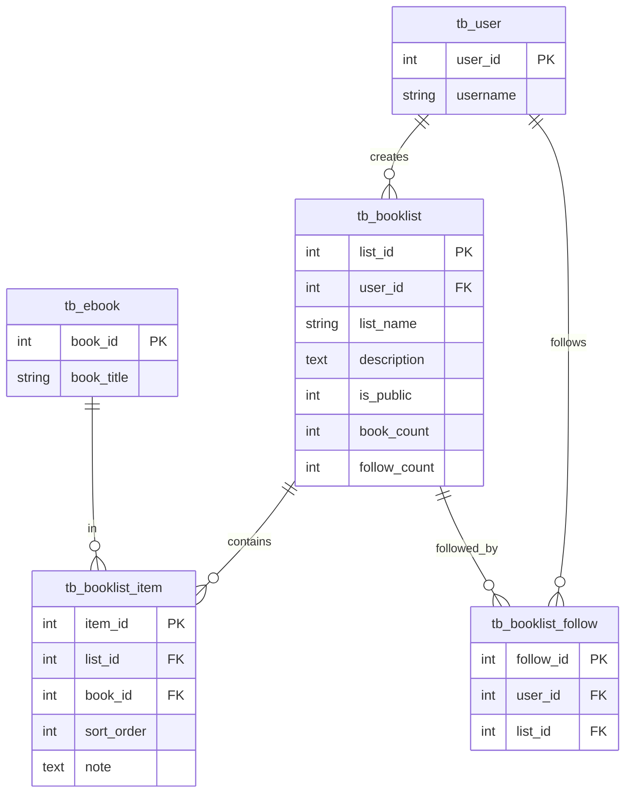

# 书单功能与推荐算法设计文档

## 📋 目录
1. [推荐算法设计](#推荐算法设计)
2. [书单功能设计](#书单功能设计)
3. [数据库表结构](#数据库表结构)
4. [API 接口设计](#api-接口设计)
5. [实现建议](#实现建议)

---

## 🎯 推荐算法设计

### 设计原则
- ✅ 基于现有表，无需新增用户行为追踪表
- ✅ 算法简单但有效，适合毕业设计
- ✅ 可以展示推荐系统的核心思想
- ✅ 计算效率高，适合 SQLite

### 推荐算法类型

#### 1. 热门推荐（最简单）⭐⭐⭐⭐⭐

**数据来源**：`tb_ebook` 表
**推荐逻辑**：
```sql
-- 综合评分推荐
SELECT * FROM tb_ebook 
WHERE status = 1 
ORDER BY (rating * 0.7 + (rating_count / 100.0) * 0.3) DESC 
LIMIT 10;

-- 最多浏览推荐
SELECT * FROM tb_ebook 
WHERE status = 1 
ORDER BY view_count DESC 
LIMIT 10;

-- 最多下载推荐
SELECT * FROM tb_ebook 
WHERE status = 1 
ORDER BY download_count DESC 
LIMIT 10;
```

**优点**：
- 实现简单
- 计算快速
- 适合新用户（冷启动）

#### 2. 基于分类的推荐 ⭐⭐⭐⭐

**数据来源**：`tb_order_item` + `tb_favorite` + `tb_category`
**推荐逻辑**：
```java
// 1. 获取用户购买/收藏过的书籍的分类
List<Long> userCategories = getUserPreferredCategories(userId);

// 2. 推荐这些分类下的高分书籍
SELECT e.* FROM tb_ebook e
WHERE e.category_id IN (userCategories)
  AND e.book_id NOT IN (用户已购买/收藏的书籍)
  AND e.status = 1
ORDER BY e.rating DESC, e.rating_count DESC
LIMIT 10;
```

**优点**：
- 个性化程度高
- 基于用户真实偏好
- 实现相对简单

#### 3. 基于协同过滤的简化版 ⭐⭐⭐⭐

**数据来源**：`tb_order_item` + `tb_favorite`
**推荐逻辑**：

```java
/**
 * 简化的协同过滤推荐
 * 1. 找到和当前用户有相似购买/收藏行为的其他用户
 * 2. 推荐这些用户喜欢但当前用户还没有的书籍
 */
public List<EBook> getCollaborativeRecommendations(Long userId) {
    // 1. 获取当前用户购买/收藏的书籍
    Set<Long> userBooks = getUserBooks(userId);
    
    // 2. 找到购买/收藏了相同书籍的其他用户
    List<Long> similarUsers = findSimilarUsers(userId, userBooks);
    
    // 3. 获取这些用户喜欢的其他书籍
    List<Long> recommendedBookIds = getOtherUsersBooks(similarUsers, userBooks);
    
    // 4. 按热度排序返回
    return getBooksByIds(recommendedBookIds);
}
```

**SQL 实现**：
```sql
-- 找到购买了相同书籍的其他用户
SELECT DISTINCT oi2.user_id, COUNT(*) as common_books
FROM tb_order_item oi1
JOIN tb_order_item oi2 ON oi1.book_id = oi2.book_id
WHERE oi1.user_id = ? AND oi2.user_id != ?
GROUP BY oi2.user_id
ORDER BY common_books DESC
LIMIT 10;

-- 获取这些用户购买的其他书籍
SELECT e.*, COUNT(*) as recommend_score
FROM tb_ebook e
JOIN tb_order_item oi ON e.book_id = oi.book_id
WHERE oi.user_id IN (相似用户列表)
  AND e.book_id NOT IN (当前用户已购买的书籍)
  AND e.status = 1
GROUP BY e.book_id
ORDER BY recommend_score DESC, e.rating DESC
LIMIT 10;
```

**优点**：
- 真正的个性化推荐
- 可以发现用户可能感兴趣的新书
- 展示推荐系统核心思想

#### 4. 基于书单的推荐（新增）⭐⭐⭐⭐⭐

**数据来源**：`tb_booklist` + `tb_booklist_item`
**推荐逻辑**：
```sql
-- 推荐热门书单
SELECT * FROM tb_booklist 
WHERE is_public = 1 
ORDER BY follow_count DESC, view_count DESC 
LIMIT 10;

-- 推荐书单中的书籍
SELECT e.*, COUNT(*) as list_count
FROM tb_ebook e
JOIN tb_booklist_item bli ON e.book_id = bli.book_id
JOIN tb_booklist bl ON bli.list_id = bl.list_id
WHERE bl.is_public = 1
  AND e.book_id NOT IN (用户已购买的书籍)
GROUP BY e.book_id
ORDER BY list_count DESC, e.rating DESC
LIMIT 10;
```

**优点**：
- 利用用户生成内容（UGC）
- 推荐质量高（经过人工筛选）
- 增加用户互动

### 推荐策略组合

```java
/**
 * 混合推荐策略
 * 根据用户状态选择合适的推荐算法
 */
public List<EBook> getRecommendations(Long userId) {
    List<EBook> recommendations = new ArrayList<>();
    
    // 1. 新用户：热门推荐 + 分类推荐
    if (isNewUser(userId)) {
        recommendations.addAll(getHotBooks(5));
        recommendations.addAll(getCategoryTopBooks(5));
    }
    // 2. 老用户：协同过滤 + 分类推荐 + 书单推荐
    else {
        recommendations.addAll(getCollaborativeRecommendations(userId, 4));
        recommendations.addAll(getCategoryRecommendations(userId, 3));
        recommendations.addAll(getBooklistRecommendations(userId, 3));
    }
    
    // 3. 去重和排序
    return deduplicateAndSort(recommendations);
}
```

---

## 📚 书单功能设计

### 功能概述

书单功能允许用户创建、管理和分享自己的电子书收藏列表，类似于豆瓣的豆列或网易云音乐的歌单。

### 核心功能

#### 1. 书单管理
- ✅ 创建书单（名称、描述、公开/私密）
- ✅ 编辑书单信息
- ✅ 删除书单
- ✅ 查看我的书单列表

#### 2. 书单内容管理
- ✅ 添加书籍到书单
- ✅ 从书单移除书籍
- ✅ 调整书籍顺序
- ✅ 为书籍添加推荐理由/笔记

#### 3. 书单浏览
- ✅ 浏览公开书单（热门、最新）
- ✅ 查看书单详情
- ✅ 查看书单中的书籍列表
- ✅ 搜索书单

#### 4. 书单互动
- ✅ 关注/取消关注书单
- ✅ 查看我关注的书单
- ✅ 浏览次数统计

### 用户场景

#### 场景1：创建学习书单
```
用户：小明（计算机专业学生）
需求：创建一个"Java学习路线"书单
操作：
1. 点击"创建书单"
2. 输入书单名称和描述
3. 选择公开
4. 添加《Java编程思想》等书籍
5. 为每本书添加推荐理由
6. 保存书单
```

#### 场景2：发现好书
```
用户：小红（科幻爱好者）
需求：发现更多科幻小说
操作：
1. 浏览"热门书单"
2. 发现"必读科幻小说"书单
3. 查看书单详情和书籍列表
4. 关注该书单
5. 将感兴趣的书加入购物车
```

#### 场景3：分享阅读计划
```
用户：老师
需求：为学生推荐阅读书目
操作：
1. 创建"2024年推荐阅读"书单
2. 添加精选书籍
3. 为每本书写推荐理由
4. 设置为公开
5. 分享书单链接给学生
```

---

## 🗄️ 数据库表结构

### 新增表（3张）

#### 1. tb_booklist（书单表）

| 字段名 | 类型 | 说明 |
|--------|------|------|
| list_id | INTEGER | 书单ID（主键） |
| user_id | INTEGER | 创建者ID |
| list_name | VARCHAR(100) | 书单名称 |
| description | TEXT | 书单描述 |
| cover_img | VARCHAR(200) | 书单封面 |
| is_public | TINYINT | 是否公开（1-公开 0-私密） |
| book_count | INTEGER | 书籍数量 |
| follow_count | INTEGER | 关注数 |
| view_count | INTEGER | 浏览次数 |
| create_time | DATETIME | 创建时间 |
| update_time | DATETIME | 更新时间 |

#### 2. tb_booklist_item（书单-书籍关联表）

| 字段名 | 类型 | 说明 |
|--------|------|------|
| item_id | INTEGER | 项目ID（主键） |
| list_id | INTEGER | 书单ID |
| book_id | INTEGER | 书籍ID |
| sort_order | INTEGER | 排序值 |
| note | TEXT | 推荐理由/笔记 |
| create_time | DATETIME | 添加时间 |

#### 3. tb_booklist_follow（书单关注表）

| 字段名 | 类型 | 说明 |
|--------|------|------|
| follow_id | INTEGER | 关注ID（主键） |
| user_id | INTEGER | 用户ID |
| list_id | INTEGER | 书单ID |
| create_time | DATETIME | 关注时间 |

### 表关系图



### 触发器设计

SQLite 支持触发器，可以自动维护统计数据：

1. **自动更新书单的书籍数量**
   - 添加书籍时 +1
   - 删除书籍时 -1

2. **自动更新书单的关注数**
   - 关注时 +1
   - 取消关注时 -1

---

## 🔌 API 接口设计

### 书单管理接口

#### 1. 创建书单
```
POST /api/v1/booklists
Content-Type: application/json

{
  "listName": "Java学习路线",
  "description": "从入门到精通",
  "isPublic": true
}
```

#### 2. 获取我的书单列表
```
GET /api/v1/booklists/my?pageNumber=1&pageSize=10
```

#### 3. 获取书单详情
```
GET /api/v1/booklists/{listId}
```

#### 4. 更新书单信息
```
PUT /api/v1/booklists/{listId}
Content-Type: application/json

{
  "listName": "Java学习路线（更新版）",
  "description": "2024最新版",
  "isPublic": true
}
```

#### 5. 删除书单
```
DELETE /api/v1/booklists/{listId}
```

### 书单内容管理接口

#### 6. 添加书籍到书单
```
POST /api/v1/booklists/{listId}/books
Content-Type: application/json

{
  "bookId": 1,
  "note": "入门必读，讲解深入浅出"
}
```

#### 7. 从书单移除书籍
```
DELETE /api/v1/booklists/{listId}/books/{bookId}
```

#### 8. 获取书单中的书籍列表
```
GET /api/v1/booklists/{listId}/books?pageNumber=1&pageSize=10
```

#### 9. 调整书籍顺序
```
PUT /api/v1/booklists/{listId}/books/{bookId}/order
Content-Type: application/json

{
  "sortOrder": 1
}
```

### 书单浏览接口

#### 10. 浏览公开书单
```
GET /api/v1/booklists/public?sort=hot&pageNumber=1&pageSize=10
# sort: hot(热门), latest(最新), follow(关注最多)
```

#### 11. 搜索书单
```
GET /api/v1/booklists/search?keyword=Java&pageNumber=1&pageSize=10
```

### 书单互动接口

#### 12. 关注书单
```
POST /api/v1/booklists/{listId}/follow
```

#### 13. 取消关注书单
```
DELETE /api/v1/booklists/{listId}/follow
```

#### 14. 获取我关注的书单
```
GET /api/v1/booklists/following?pageNumber=1&pageSize=10
```

#### 15. 检查是否关注
```
GET /api/v1/booklists/{listId}/follow/check
```

### 推荐接口

#### 16. 获取个性化推荐
```
GET /api/v1/recommendations/personal?limit=10
```

#### 17. 获取热门推荐
```
GET /api/v1/recommendations/hot?limit=10
```

#### 18. 获取分类推荐
```
GET /api/v1/recommendations/category?categoryId=1&limit=10
```

#### 19. 获取书单推荐
```
GET /api/v1/recommendations/booklists?limit=10
```

---

## 💡 实现建议

### 开发优先级

#### 阶段一：核心功能（必须）
1. ✅ 创建/编辑/删除书单
2. ✅ 添加/移除书籍
3. ✅ 查看书单详情
4. ✅ 浏览公开书单

#### 阶段二：推荐功能（推荐）
1. ✅ 热门推荐
2. ✅ 基于分类的推荐
3. ✅ 基于书单的推荐

#### 阶段三：高级功能（可选）
1. ⏳ 协同过滤推荐
2. ⏳ 书单关注功能
3. ⏳ 书单搜索
4. ⏳ 书籍排序和笔记

### 技术实现要点

#### 1. 推荐算法缓存
```java
// 使用简单的内存缓存
private Map<String, List<EBook>> recommendationCache = new ConcurrentHashMap<>();

public List<EBook> getHotBooks() {
    String cacheKey = "hot_books";
    if (recommendationCache.containsKey(cacheKey)) {
        return recommendationCache.get(cacheKey);
    }
    
    List<EBook> hotBooks = eBookMapper.selectHotBooks();
    recommendationCache.put(cacheKey, hotBooks);
    return hotBooks;
}
```

#### 2. 书单封面自动生成
```java
// 使用书单中第一本书的封面作为书单封面
public String getBooklistCover(Long listId) {
    EBook firstBook = booklistMapper.selectFirstBook(listId);
    return firstBook != null ? firstBook.getCoverImg() : "default_cover.jpg";
}
```

#### 3. 浏览次数统计
```java
// 异步更新浏览次数，不影响查询性能
@Async
public void incrementViewCount(Long listId) {
    booklistMapper.incrementViewCount(listId);
}
```

### 前端展示建议

#### 1. 书单卡片
```html
<div class="booklist-card">
  
  <h3>书单名称</h3>
  <p>描述</p>
  <div class="stats">
    <span>📚 10本书</span>
    <span>❤️ 256关注</span>
  </div>
</div>
```

#### 2. 推荐区域
```html
<div class="recommendations">
  <h2>为你推荐</h2>
  <div class="book-list">
    <!-- 推荐的书籍卡片 -->
  </div>
</div>
```

---

## 📊 数据库更新总结

### 表数量变化

| 版本 | 表数量 | 说明 |
|------|--------|------|
| 简化版 | 8 张 | 核心功能 |
| **加入书单功能** | **11 张** | **+3 张书单相关表** |

### 新增表的必要性

| 表名 | 必要性 | 理由 |
|------|--------|------|
| tb_booklist | ⭐⭐⭐⭐⭐ | 核心功能，必须 |
| tb_booklist_item | ⭐⭐⭐⭐⭐ | 核心功能，必须 |
| tb_booklist_follow | ⭐⭐⭐ | 增强互动，推荐实现 |

### 推荐算法所需表

| 算法类型 | 所需表 | 是否需要新增 |
|----------|--------|--------------|
| 热门推荐 | tb_ebook | ❌ 已有 |
| 分类推荐 | tb_ebook, tb_category, tb_order_item, tb_favorite | ❌ 已有 |
| 协同过滤 | tb_order_item, tb_favorite | ❌ 已有 |
| 书单推荐 | tb_booklist, tb_booklist_item | ✅ 需要新增 |

---

## 🎯 总结

### ✅ 推荐算法：不需要加回用户行为表

**理由**：
1. 现有表（tb_order_item, tb_favorite, tb_review）足够实现简单推荐
2. 可以实现热门推荐、分类推荐、协同过滤等多种算法
3. 适合毕业设计的复杂度和时间要求

### ✅ 书单功能：需要新增 3 张表

**新增表**：
1. tb_booklist - 书单表
2. tb_booklist_item - 书单-书籍关联表
3. tb_booklist_follow - 书单关注表（可选）

**优势**：
- 增加项目创新点和亮点
- 提升用户体验和互动性
- 可以作为推荐算法的数据源
- 展示 UGC（用户生成内容）设计能力

### 📊 最终表结构

**核心表（8张）**：
- tb_user, tb_category, tb_ebook, tb_order, tb_order_item, tb_cart, tb_favorite, tb_review

**书单功能（3张）**：
- tb_booklist, tb_booklist_item, tb_booklist_follow

**总计：11 张表**

这个设计在保持简洁的同时，增加了有价值的功能，非常适合毕业设计！
